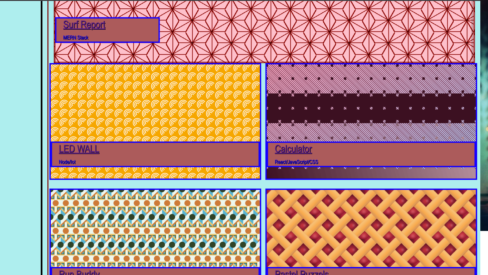
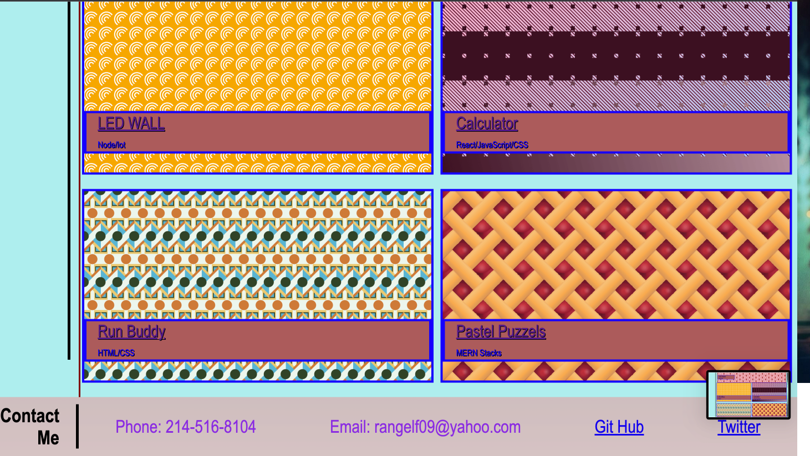
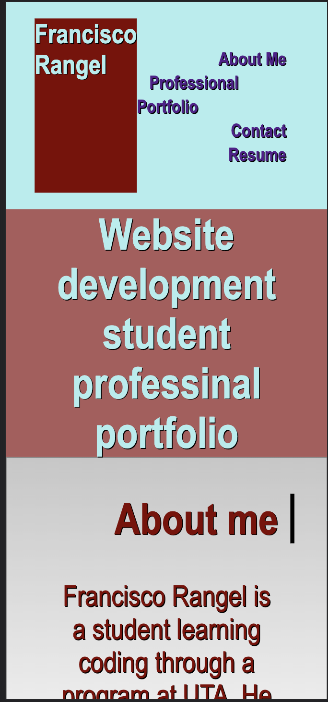
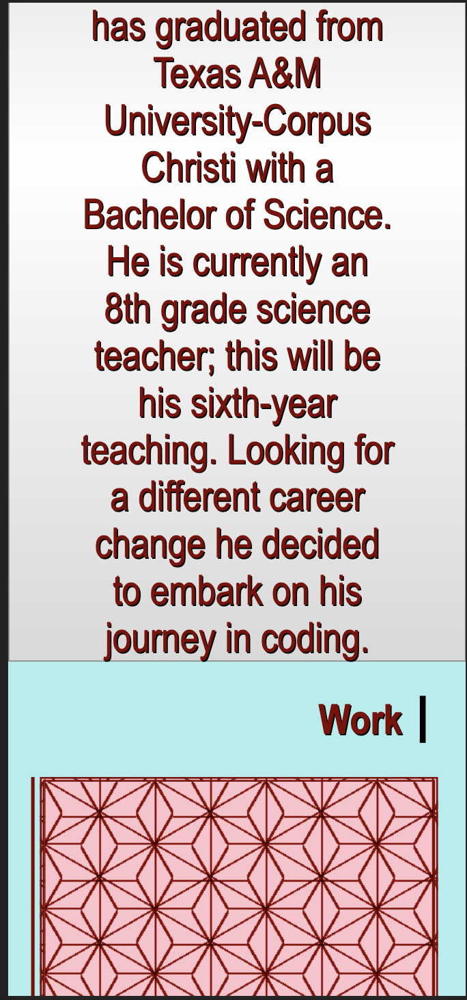
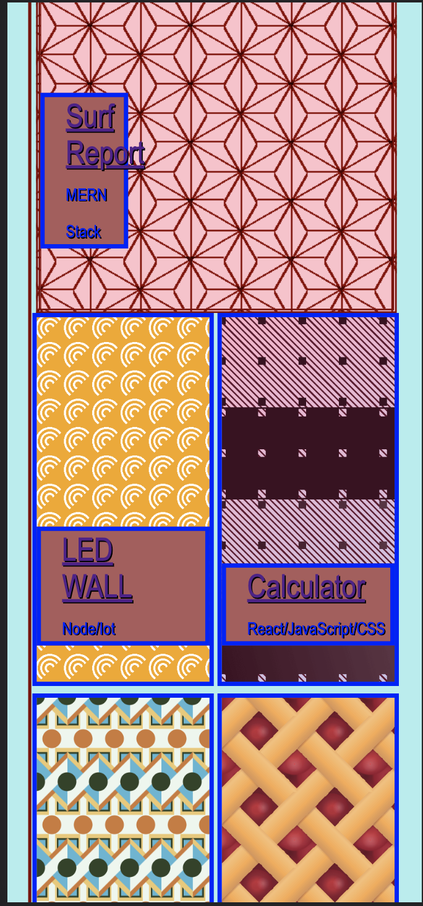
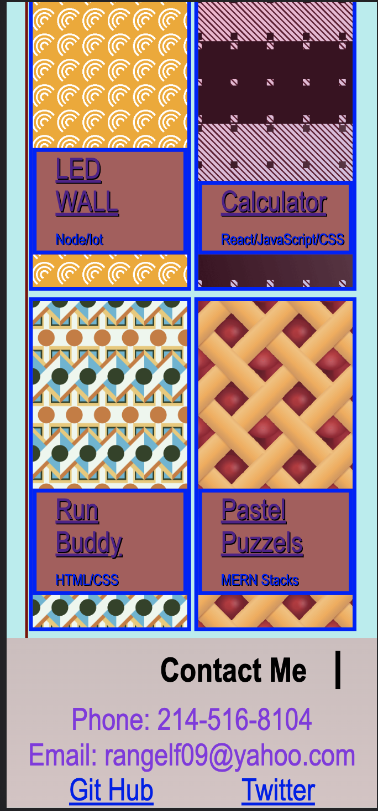

<!-- Progress portfolio -->
## Rangel-Proggress-Portfolio
    This is a portfolio of a potential employee. This website shows diffrent sections of the employee inluding, header, subtitle, about me, work and contact information. 
    Style sheet was added to give the website more color and added flexbox to become responsive with diifferent devices. 
## Screen Shots Full Screen
These images show desktop view.

 
 

## Screen Shots Small Screen
These images show mobile device view.

 
 
 

## Work Cite 
Code from the past challenge was observe to understand moving the columns and rows around. 
Features like the margin block was found https://docs.w3cub.com/css/margin-block-start
Media query was found https://www.w3schools.com/cssref/css3_pr_mediaquery.asp

